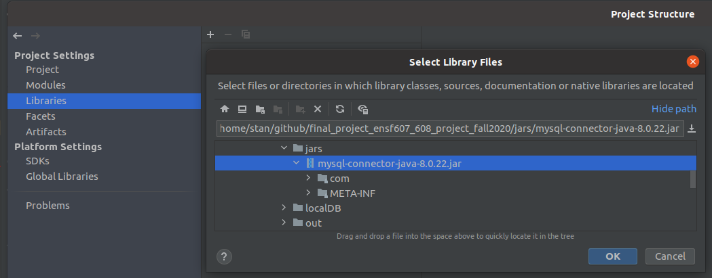

# Golden Stacko post
https://stackoverflow.com/questions/2839321/connect-java-to-a-mysql-database


#Setup MySQL

Linux
https://dev.mysql.com/doc/refman/8.0/en/linux-installation.html

https://www.digitalocean.com/community/tutorials/how-to-install-mysql-on-ubuntu-18-04#prerequisites

```
sudo apt-get install mysql-server
```


Windows
https://dev.mysql.com/doc/refman/8.0/en/windows-installation.html


# instruction provided by the lab

Here is help/resources for installing and using MySQL:
• For the most part, installing the database, is quite simple and is basically about downloading and
running the installer:

https://dev.mysql.com/downloads/windows/installer/

Once you run the installer, it allows you to set your username and password.

• Then you can download JDBC:

https://dev.mysql.com/downloads/connector/j/8.0.html

• From there, you can include JDBC in your project. Here is a video which provides step-by-step
instructions of this:

https://www.youtube.com/watch?v=2i4t-SL1VsU

---


# If using Intellij



go to `file`, `project structure`, then add `jar` to `libraries`