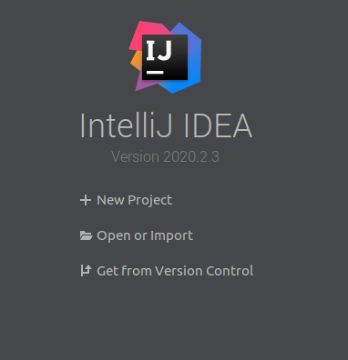
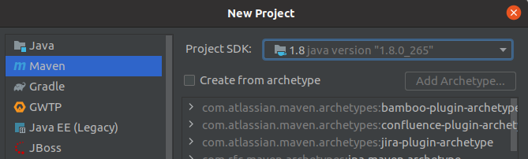
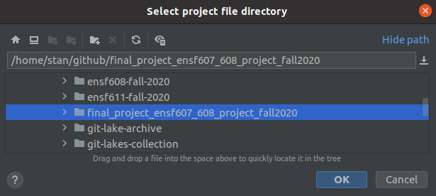
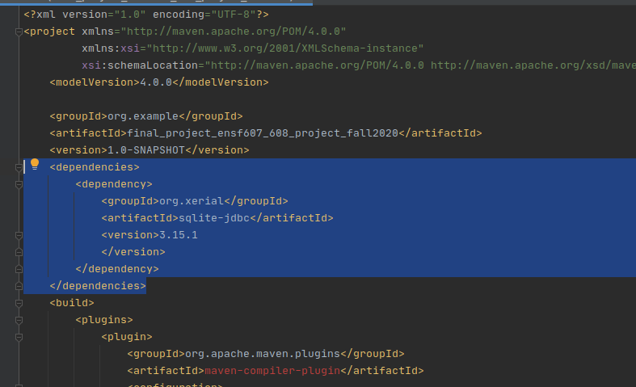

SQLite is a quick and easy way to spin up a SQL env. However in order to do the demon, we need to spin up a real mysql.
##### step by step guide (Dev) 

1. select new project


2. select 'maven' project and prefered JDK

3. select location of this cloned repo

4. fulfill the jdbc dependency (if IDE accidentally override the pom sheet, please roll back & don't commit)

5. run `src/test/java/SetupSqliteDevEnvTest.java`, if console output prompts something similar as following, then it's game time. cheers.

   ```
   2020-11-13 22:44:38.307 log: a db is about to be created under: 
   /home/stan/github/final_project_ensf607_608_project_fall2020/localDB/test.db
   2020-11-13 22:44:38.307 log: The driver name is SQLiteJDBC
   2020-11-13 22:44:38.307 log: A new database has been created.
   
   Process finished with exit code 0
   ```