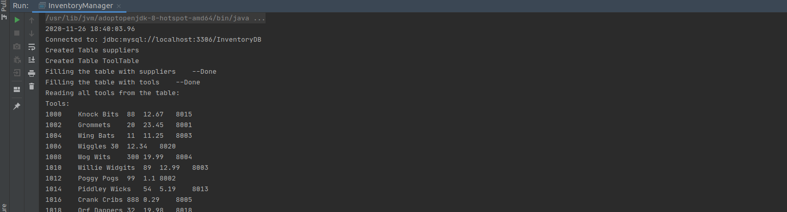
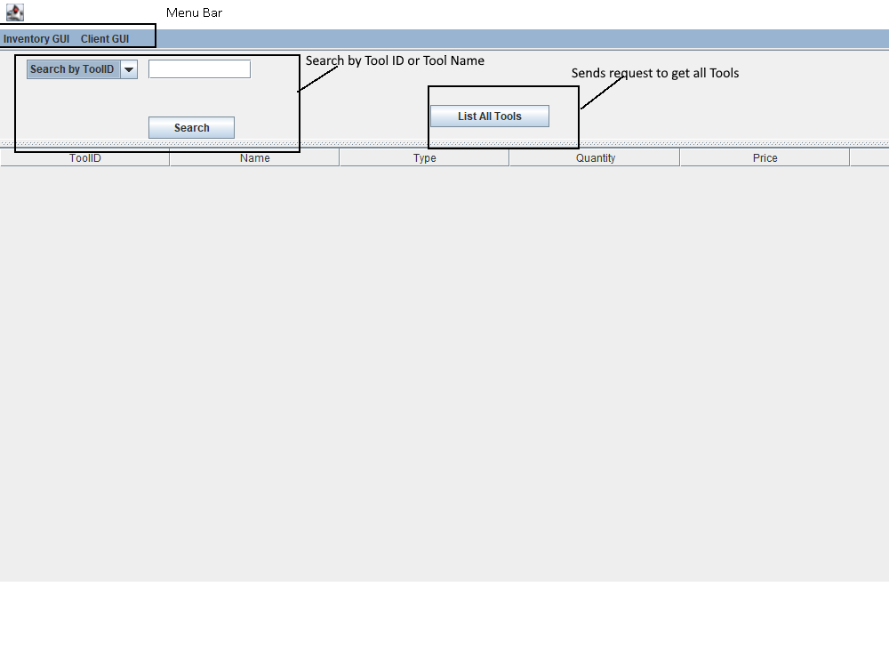
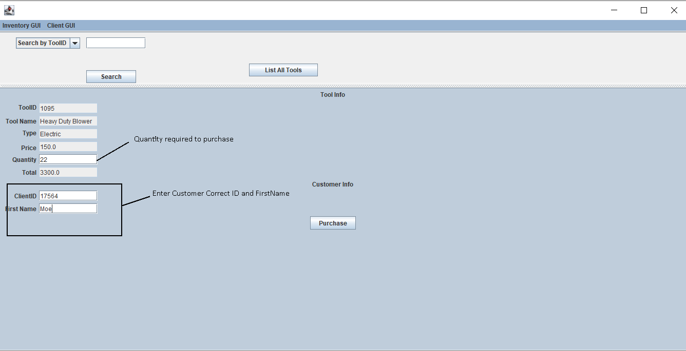
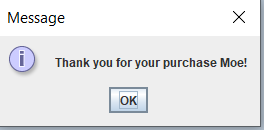
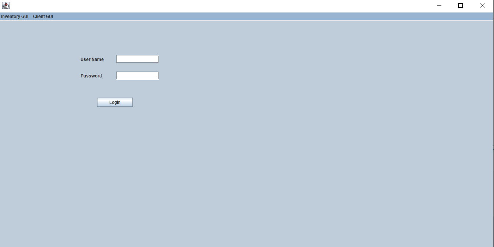
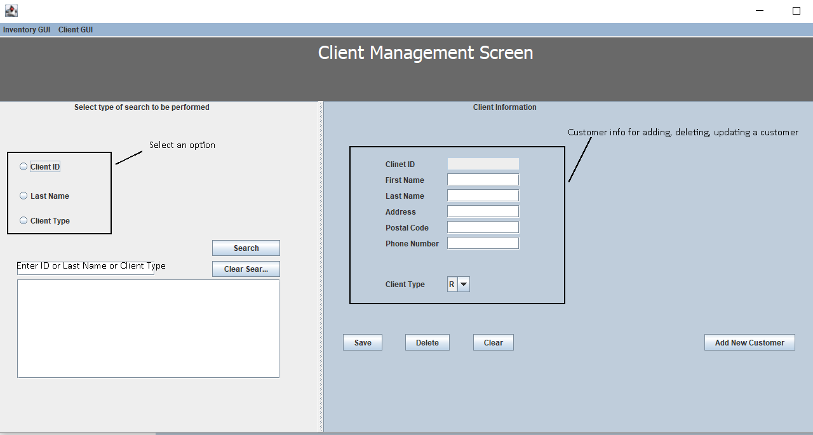
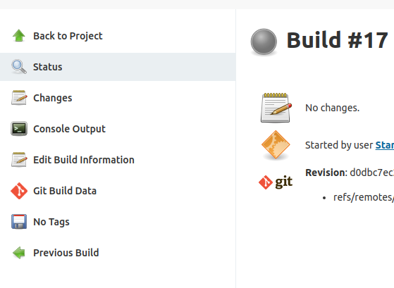

# Classic ToolShop Desktop App with API
This is a joint, cross-course project with ENSF 607/608. It is a classic Tool Shop desktop application written in Java. 

## Contributors

Ziad Chemali, Stan Chen


## Quick Start

#### Client and remote server

1. fulfill dependencies in `pom.xml` if builds are missing packages
2. making sure remote backend server is up and running. (See note below)
3. to connect to the remote client, compile and run `src/client/main.java`


#### Client and local server

1. fulfill dependencies in `pom.xml` if builds are missing packages
2. to start the server, compile and run `src/server/startServerLocal.java` (See note below)
3. to start the local client, compile and run `src/client/mainLocal.java` 


### Pre-project Demo

to run the pre-project demo, please compile and run `src/preproject/InventoryManager.java`.

An running mysql is required to be hosted at localhost:3306



After running the InventoryManager.java, the program should generate log similiar to the following:

```
2020-11-26 18:40:03.96
Connected to: jdbc:mysql://localhost:3306/InventoryDB
Created Table suppliers
Created Table ToolTable
Filling the table with suppliers	--Done
Filling the table with tools	--Done
Reading all tools from the table:
Tools:
1000	Knock Bits	88	12.67	8015
1002	Grommets	20	23.45	8001
1004	Wing Bats	11	11.25	8003
1006	Wiggles	30	12.34	8020
1008	Wog Wits	300	19.99	8004
1010	Willie Widgits	89	12.99	8003
1012	Poggy Pogs	99	1.1	8002
1014	Piddley Wicks	54	5.19	8013
1016	Crank Cribs	888	0.29	8005
1018	Orf Dappers	32	19.98	8018
1020	Knit Piks	66	6.75	8015
1022	Tic Tocs	87	1.36	8014
1024	Thinga-ma-bobs	40	10.98	8012
1026	Barn Bins	45	88.67	8006
1028	Pong Pangs	2345	0.1	8002
1030	Nic Nacs	238	2.99	8015
1032	Lilly Larks	56	12.99	8007
1034	Cork Handles	654	2.66	8016
1036	Erk Orks	498	3.99	8017
1038	Googly Eyes	756	6.99	8001
1040	Inny Outies	219	3.45	8010


Reading all suppliers from the table:
Suppliers:
8001	Grommet Builders	788 30th St., SE, Calgary	Fred
8002	Pong Works	749 Dufferin Blvd., SE, Calgary	Bart
8003	Wiley Inc.	26 40th St., SE, Calgary	BillyBob
8004	Winork Manufacturing Inc.	156 51st Ave., SE, Calgary	Marty
8005	Grab Bag Inc.	138 42nd Ave., NE, Calgary	Monty
8006	Paddy's Manufacturing	311 McCall Way, NE, Calgary	Barney
8007	Smickles Industries	966 Smed Lane, SE, Calgary	Lisa
8008	Thangs Inc.	879 37th Ave., NE, Calgary	Thelma
8009	Flip Works Inc.	472 Ogden Dale Rd., SE, Calgary	Rory
8010	Irkle Industries	754 Sunridge Way, NE, Calgary	Irma
8011	Biff Builders	690 19th St., NE, Calgary	Borjn
8012	Twinkles Inc.	318 29th St.,NE, Calgary	Barkley
8013	Piddles Industries	238 112th Ave., NE, Calgary	Parnell
8014	Tic Tac Manufacturing	598 Palmer Rd., NE, Calgary	Teisha
8015	Knock Knock Inc.	363 42nd Ave., NE, Calgary	Ned
8016	Corky Things Inc.	35 McCall Way, NE, Calgary	Corrine
8017	E & O Industries	883 44th St., SE, Calgary	Stan
8018	Fiddleys Makes Stuff Inc.	350 27th St., NE, Calgary	Fredda
8019	Horks and Stuff Manufacturing	997 42nd Ave., NE, Calgary	Harold
8020	Wings Works	754 48th St., SE, Calgary	Wing


Searching table for tool 1002: should return 'Grommets'
Search Result:	1002	Grommets	20	23.45	8001	

Searching table for tool 9000: should fail to find a tool
Search Failed to find a tool matching id: 9000
The program is finished running

Process finished with exit code 0

```


## Summary

Inventory management system that has two functionalities:

- Allows owner to add new customers/update their information and allows customers to search for tools from the data base and purchase.
- If the quantity of an item goes below 40 items then the program automatically generates an order line for that item


## Architecture


## Front-End

The front end is a GUI application that will send messages in a JSON format to the server via sockets, then it will receive a response. Example if search by ToolId is selected  a we are searching for a ToolID of 8000 then it will send a JSON message as follow:  ```"{ \"type\" : \"GET\", \"table\" : \"TOOL\" , \"scope\":\"select\",\"field\":\"ToolID\",\"field_value\":\"8000\"}";```

The response is a JSON Node as follows ```[ {  "ToolID" : 8000,  "Name" : "Knock Bitzzz",  "Type" : "Electric",  "Quantity" : 70,  "Price" : 15.0,  "SupplierID" : 8004,  "PowerType" : null} ]```

 And it will be printed in the GUI

#### GUI Panels

**1. Inventory Panel **



**Note**: If you press <u>List All Tools</u> or <u>Search</u> (with correct ToolID or Tool Name) the following table is generated


**2. Purchase Panel **

After selecting a row from the table, purchase panel will appear




if the customer ID/First Name are correct then purchase will be generated and the following pop-up will appear



else this pop-up will appear


**3. CMS Panel **

press on ClientGUI option from the menu bar, it will direct you to a Login panel



If username/password are correct then the client management panel will show



**Updating/Deleting a customer**

First search for a customer then select the customer from the JList. After selecting a row, the Client Information in the right side will be populated automatically


**Adding new customer **

Simply fill in all the fields required, and click Add New Customer. Note: a unique client Id will be generated


Double check by searching for the newly added customer


Customer successfully added


## Back-End

### How to start local backend server

to start the local backend server, compile and run 

```
src/server/startServerLocal.java
```

if the console prints the following, it means the server is ready. 


### How to start remote backend server

Note: For temporary demo purpose, Prof & TA can access:  

**Our jenkins build server http://54.185.156.100:8080/**

**username: `ensf`  **

**password: `ensf607`**


If server is not running, build the job "Final Project Demo" to start the backend server. 


click into the project



In this job page, click `Console Output`, 


If the end of the console log prints the logs as above, this means the server is ready to serve. 


## Testing

Jenkins were introduced as a tool to help with the deployment/testing purposes. Script used for compiling and running the backend server in Jenkins build execute shell: 

```shell
# export CLASSPATH=jars/*.jar
mvn -v
echo "building maven package"
mvn clean install -U
mvn clean package
echo "initing server"
echo "building maven package"
mvn package
echo "initing server"
mvn exec:java -Dexec.mainClass="server.controller.ServerController" -Dexec.classpathScope=runtime 
```


## Develop setup

1. this is classic java project. `jars/mysql-connector-java-8.0.22.jar` needs to be added to class path. 
2. Alternatively, if using maven, just use pom.xml to fullfil the dependencies.
